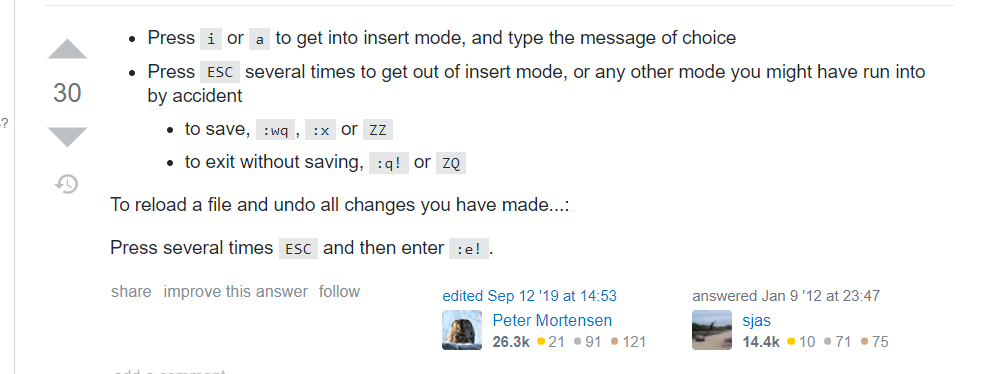

# Internship_at_Technocolab.
---
:wave:Hi  
* Web-Devlopment-Intern 
* Date_Starting: 20-july-2020. 
## Motive of Repo :-
---
Storing My Task , for Technocolab team to check them 
:white_check_mark: `Minor-Tasks`  
### Work-Done :-
---
Updated after each project is completed. 
:large_orange_diamond:`MINOR-TASKS` 
⚫Project-1    ⚫Project-9  
⚫Project-2    ⚫Project-10 
⚫Project-3    ⚫Project-11 
⚫Project-4    ⚫Project-12 
⚫Project-5    ⚫Project-13 
⚫Project-6    ⚫Project-14 
⚫Project-7    ⚫Project-15 
⚫Project-8 
#### Have-Doubts
---
Please feel Free to mail -> :email:`yjain3.436@gmail.com` 
#### Suggestions 
---
:bulb: Since it is public Repository  for Technocolab-Team. 
:x: No PR's would be merged here

## Everytime fetching this occurs
  
now a solution 

